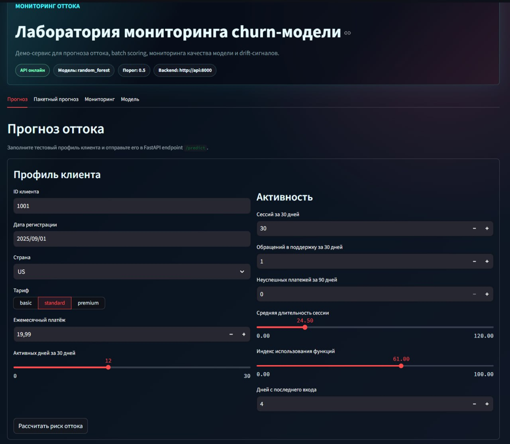
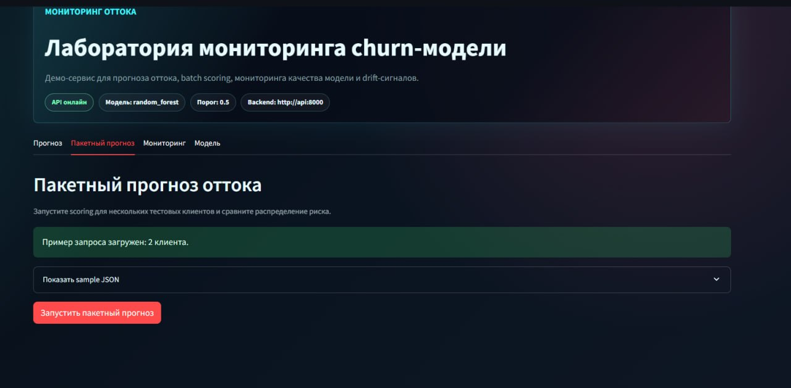
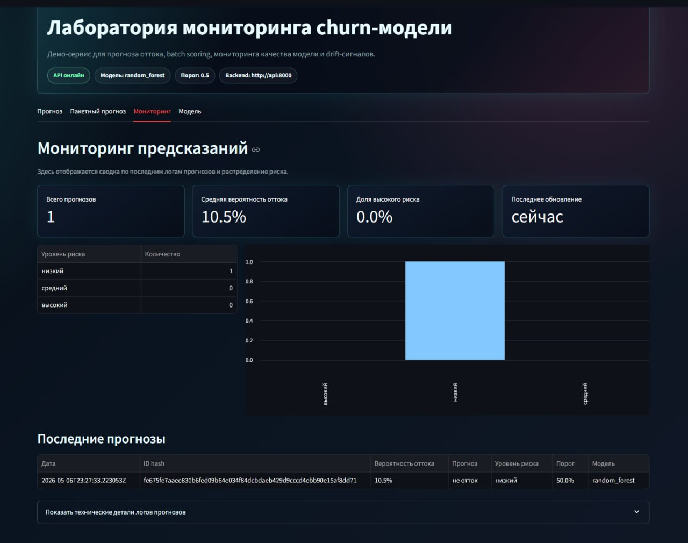
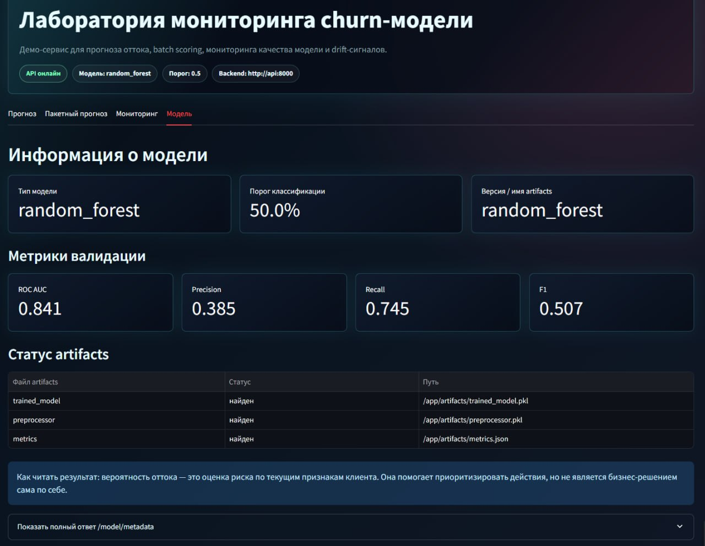

# Churn Risk & Model Monitoring Lab

Портфолио-проект в формате приближенного к продакшену ML-сервиса: прогноз
оттока пользователей, API-инференс, логирование предсказаний, мониторинг
модели и интерактивный Streamlit-dashboard.

Проект показывает полный путь:

```text
синтетические данные -> подготовка признаков -> обучение -> артефакты
-> FastAPI-инференс -> PostgreSQL-логи -> мониторинг -> Streamlit-dashboard
```

## Бизнес-задача

Подписочный продукт хочет заранее находить пользователей с повышенным риском
оттока. Если риск известен до ухода клиента, бизнес может запустить retention:
персональную коммуникацию, помощь поддержки, обучение продукту, скидку или
ручную работу аккаунт-менеджера.

Модель оценивает вероятность churn по активности в продукте, платежным
проблемам, обращениям в поддержку, тарифу и давности последнего входа.

## Что демонстрирует проект

Проект ориентирован на junior Data Scientist / ML Engineer роль и показывает:

- воспроизводимую генерацию синтетического датасета;
- инженерную подготовку признаков вне ноутбука;
- обучение базовых моделей и сохранение артефактов;
- FastAPI-инференс с Pydantic-схемами;
- одиночный и пакетный прогноз оттока;
- PostgreSQL-логи предсказаний;
- приватное логирование: исходный `user_id` не сохраняется;
- метаданные модели, PSI drift и эндпоинты мониторинга качества;
- Streamlit-dashboard поверх API, полностью русифицированный для демо на РФ-рынке;
- pytest, Ruff, Docker Compose и GitHub Actions CI.

## Живое демо

Это не одна метрика в ноутбуке, а цельный мини-продукт: модель можно обучить,
поднять через Docker Compose, отправить прогноз через API, сохранить лог в
PostgreSQL и сразу увидеть результат в дашборде. Для работодателя это важный
сигнал: проект показывает не только ML-часть, но и инженерную обвязку вокруг
модели.

### Одиночный прогноз

Форма имитирует рабочий сценарий retention-команды: пользовательские признаки
заполняются в интерфейсе, запрос уходит в FastAPI-эндпоинт `/predict`, а
дашборд возвращает вероятность оттока, бинарный прогноз и уровень риска.



### Пакетный прогноз

Пакетный режим показывает, что сервис умеет обрабатывать несколько клиентов за
один запрос. Это полезно для ежедневного скоринга: загрузили пример JSON,
запустили `/predict/batch`, получили таблицу результатов для приоритизации.



### Мониторинг предсказаний

Мониторинг собирает последние логи предсказаний и превращает их в понятную
операционную картину: сколько прогнозов сделано, какая средняя вероятность
оттока, какая доля клиентов попала в высокий риск и как распределены уровни риска.



### Информация о модели

Вкладка модели показывает артефакты, порог классификации и метрики валидации.
Так ревьюер сразу видит, что модель не является “черным ящиком”: у сервиса есть
прозрачные метрики, версия артефактов и проверяемое состояние файлов.



## Архитектура

```text
data/raw синтетический CSV
    -> app.ml.preprocessing
    -> data/processed train/validation CSV
    -> app.ml.training
    -> artifacts/trained_model.pkl + preprocessor.pkl + metrics.json
    -> FastAPI /predict и /predict/batch
    -> PostgreSQL prediction_logs
    -> эндпоинты мониторинга
    -> Streamlit-dashboard
```

Документация:

- [Архитектура](docs/architecture.md)
- [Примеры API-запросов](docs/api_examples.md)
- [Мониторинг](docs/monitoring.md)
- [Демо-сценарий](docs/demo_script.md)
- [Словарь данных](docs/data_dictionary.md)
- [Карточка модели](docs/model_card.md)

## Быстрый старт

### Windows PowerShell

```powershell
py -3.11 -m venv .venv
.\.venv\Scripts\Activate.ps1
python -m pip install --upgrade pip
pip install -r requirements.txt -r requirements-dev.txt
Copy-Item .env.example .env
```

Подготовить данные и модель:

```powershell
python -m app.ml.generate_synthetic_data --n-users 2000 --seed 42
python -m app.ml.preprocessing --source csv --test-size 0.2
python -m app.ml.training --source csv --n-splits 3
```

Если запускаете API локально без PostgreSQL, отключите сохранение логов:

```powershell
$env:SAVE_PREDICTIONS="false"
uvicorn app.api.main:app --reload
```

Dashboard:

```powershell
streamlit run dashboard/app.py
```

### macOS / Linux

```bash
python3.11 -m venv .venv
source .venv/bin/activate
python -m pip install --upgrade pip
pip install -r requirements.txt -r requirements-dev.txt
cp .env.example .env
```

Подготовить данные и модель:

```bash
python -m app.ml.generate_synthetic_data --n-users 2000 --seed 42
python -m app.ml.preprocessing --source csv --test-size 0.2
python -m app.ml.training --source csv --n-splits 3
```

Если запускаете API локально без PostgreSQL:

```bash
export SAVE_PREDICTIONS=false
uvicorn app.api.main:app --reload
```

Dashboard:

```bash
streamlit run dashboard/app.py
```

### Docker Compose

Docker Compose поднимает API, дашборд и PostgreSQL. В этом режиме
`SAVE_PREDICTIONS=true` и логи предсказаний пишутся в базу.

```bash
cp .env.example .env
docker compose up --build
```

Windows PowerShell:

```powershell
Copy-Item .env.example .env
docker compose up --build
```

Сервисы:

- API: <http://localhost:8000>
- Swagger UI: <http://localhost:8000/docs>
- Dashboard: <http://localhost:8501>
- PostgreSQL: `localhost:5432`

## Как проверить demo локально

Самый короткий сценарий для просмотра portfolio demo:

```bash
docker compose up --build -d
```

1. Откройте <http://localhost:8501>.
2. Убедитесь, что в верхней панели отображается `API онлайн`.
3. На вкладке `Прогноз` нажмите `Рассчитать риск оттока`.
4. Откройте `Пакетный прогноз` и нажмите `Запустить пакетный прогноз`.
5. Откройте `Мониторинг` и проверьте сводку по логам предсказаний.
6. Откройте `Модель` и проверьте метаданные и метрики валидации.

Dashboard ориентирован на русскоязычного ревьюера: вкладки, кнопки,
пояснения, ошибки, пустые состояния и таблицы отображаются на русском языке.

## Команды

Команды соответствуют `Makefile`.

| Задача | Цель Makefile | Команда |
| --- | --- | --- |
| Установить зависимости | `make install` | `pip install -r requirements.txt` |
| Сгенерировать данные | `make generate-data` | `python -m app.ml.generate_synthetic_data` |
| EDA-отчет | `make eda-report` | `python -m app.ml.eda` |
| Подготовить признаки | `make prepare-data` | `python -m app.ml.preprocessing` |
| Обучить модель | `make train` | `python -m app.ml.training` |
| Загрузить seed в БД | `make seed-db` | `python -m app.db.load_seed_data` |
| Запустить API | `make run-api` | `uvicorn app.api.main:app --reload --host 0.0.0.0 --port 8000` |
| Запустить дашборд | `make run-dashboard` | `streamlit run dashboard/app.py --server.port 8501` |
| Запустить тесты | `make test` | `pytest -q` |
| Запустить Docker Compose | `make docker-up` | `docker compose up --build` |
| Остановить Docker Compose | `make docker-down` | `docker compose down` |

Частые команды:

```bash
python -m app.ml.generate_synthetic_data --n-users 2000 --seed 42
python -m app.ml.preprocessing --source csv --test-size 0.2
python -m app.ml.training --source csv --n-splits 3
uvicorn app.api.main:app --reload
streamlit run dashboard/app.py
python -m pytest -q
docker compose up --build
```

## API-эндпоинты

| Метод | Endpoint | Назначение |
| --- | --- | --- |
| `GET` | `/health` | Проверка состояния API |
| `POST` | `/predict` | Прогноз для одного пользователя |
| `POST` | `/predict/batch` | Пакетный прогноз |
| `GET` | `/model/metadata` | Метрики модели и статус артефактов |
| `GET` | `/predictions/recent` | Последние логи предсказаний без исходного `user_id` |
| `GET` | `/monitoring/summary` | Сводка по логам предсказаний |
| `POST` | `/monitoring/drift` | Проверка PSI drift |
| `POST` | `/monitoring/quality` | ROC-AUC, precision, recall, F1 |

## Curl-примеры

Проверка API:

```bash
curl http://localhost:8000/health
```

Одиночный прогноз:

```bash
curl -X POST http://localhost:8000/predict \
  -H "Content-Type: application/json" \
  --data @data/sample/predict_sample.json
```

Пакетный прогноз:

```bash
curl -X POST http://localhost:8000/predict/batch \
  -H "Content-Type: application/json" \
  --data @data/sample/predict_batch_sample.json
```

Метаданные модели:

```bash
curl http://localhost:8000/model/metadata
```

Последние логи:

```bash
curl "http://localhost:8000/predictions/recent?limit=20"
```

Проверка drift:

```bash
curl -X POST http://localhost:8000/monitoring/drift \
  -H "Content-Type: application/json" \
  -d "{\"expected\":[1,2,3,4,5],\"actual\":[2,3,4,5,6],\"buckets\":5}"
```

Метрики качества:

```bash
curl -X POST http://localhost:8000/monitoring/quality \
  -H "Content-Type: application/json" \
  -d "{\"y_true\":[0,0,1,1],\"y_score\":[0.1,0.4,0.6,0.9],\"threshold\":0.5}"
```

Больше примеров: [docs/api_examples.md](docs/api_examples.md).

## Тестирование и CI

Локальные проверки:

```bash
python -m compileall app dashboard tests
python -m ruff check .
python -m pytest -q
docker compose config
docker build -t churn-lab:test .
```

GitHub Actions запускает компиляцию Python-модулей, Ruff, pytest,
`docker compose config` и сборку Docker-образа при push/pull request в `main`.
На теге `v*` Docker-образ публикуется в GitHub Container Registry.

## Мониторинг модели

Слой мониторинга включает:

- сводку по логам предсказаний;
- PSI для drift числовых признаков;
- метрики качества по истинным меткам и скорингам модели.

PSI показывает, насколько распределение фактических значений отличается от
ожидаемого:

- `stable`: PSI `< 0.1`;
- `warning`: `0.1 <= PSI < 0.25`;
- `drift`: PSI `>= 0.25`.

Ограничения PSI в этом проекте: это одномерный сигнал, результат зависит от
стратегии разбиения на интервалы, нет заданий по расписанию и оповещений.

Подробнее: [docs/monitoring.md](docs/monitoring.md).

## Безопасность и приватность

- Секреты не хранятся в репозитории.
- `.env` игнорируется git.
- Логи предсказаний не сохраняют исходный `user_id`; сохраняется только SHA-256 hash.
- Данные синтетические, без реальных персональных данных.
- Примеры запросов вымышленные.

## Ограничения

- Синтетический датасет, поэтому метрики не являются бизнес-бенчмарком.
- Нет продакшен-SLA, автоскейлинга и процесса реагирования на инциденты.
- Threshold `0.5` не оптимизирован под стоимость ошибок.
- Демо drift упрощено и запускается через API-запрос.
- Dashboard не является полноценной защищенной консолью.

## План развития

- Калибровка вероятностей.
- Подбор threshold с учетом стоимости ошибок.
- Мониторинг по расписанию.
- Evidently или кастомные HTML/PDF-отчеты.
- Деплой с управляемой базой данных и секретами под разные окружения.
