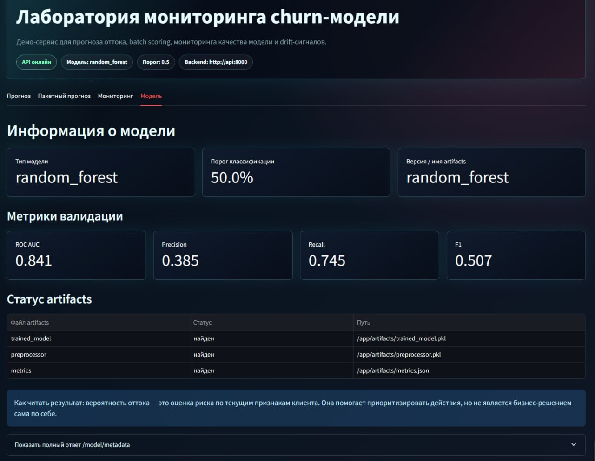

# Churn Risk & Model Monitoring Lab

[](https://github.com/TimoJR3/Churn-Risk-Model-Monitoring-Lab/actions/workflows/ci.yml)

Модель риска оттока для подписочного продукта: обучение, API для онлайн- и пакетного скоринга, логирование прогнозов в PostgreSQL и мониторинг дрейфа (PSI). Данные синтетические (2 000 пользователей, доля оттока 11,65 %), поэтому метрики показывают работоспособность пайплайна, а не бизнес-бенчмарк.

**Стек:** Python 3.11, pandas, scikit-learn, FastAPI, PostgreSQL, Streamlit, Docker Compose, pytest, Ruff, GitHub Actions.

## Результаты

| Модель | ROC-AUC, 5-fold CV (mean ± std) |
|---|---|
| **Random Forest** (выбрана) | **0,845 ± 0,040** |
| Logistic Regression | 0,844 ± 0,043 |
| HistGradientBoosting | 0,809 ± 0,032 |

Отложенная выборка (400 пользователей, 47 ушедших), порог 0,5:

| ROC-AUC | Recall | Precision | F1 | Accuracy |
|---|---|---|---|---|
| 0,841 | 0,745 (35 из 47) | 0,385 | 0,507 | 0,83 |

- Модель находит 3 из 4 уходящих пользователей. Среди отмеченных как «риск» уходят 38,5 % — в 3,3 раза больше базовой доли оттока в выборке (11,75 %). Цена — 56 ложных срабатываний на 400 пользователей.
- Главные признаки: `feature_usage_score` (0,18), `activity_score` (0,17), `days_active_last_30` (0,14) — отток определяется вовлечённостью, а не тарифом или страной.
- PSI между train и validation по всем 13 числовым признакам < 0,1 (статус `stable`, максимум 0,044 у `monthly_fee`): разбиение без перекоса, та же функция PSI работает в API мониторинга.

Источники чисел: [`artifacts/metrics.json`](artifacts/metrics.json), [`artifacts/feature_importance.csv`](artifacts/feature_importance.csv), [`artifacts/psi_train_vs_validation.csv`](artifacts/psi_train_vs_validation.csv). Метрики воспроизводятся командой `python -m app.ml.training`, PSI — `python -m app.monitoring.split_report`.

## Как устроено

```text
синтетические данные -> preprocessing -> обучение (StratifiedKFold) -> artifacts
-> FastAPI: /predict, /predict/batch -> журнал прогнозов в PostgreSQL
-> /monitoring/summary, /monitoring/drift (PSI), /monitoring/quality -> Streamlit
```

- Признаки: активность за 30 дней, сессии, использование функций, давность входа, обращения в поддержку, неудачные платежи, тариф, страна; плюс производные (`activity_score`, `payment_risk_score`, `usage_per_session` и др.).
- API возвращает вероятность оттока, класс, группу риска (`low` / `medium` / `high`) и версию модели. Без артефактов модели отвечает 503, на лету не переобучается.
- В журнал прогнозов пишется хеш `user_id`, а не сам идентификатор.
- PSI: `stable` < 0,1 ≤ `warning` < 0,25 ≤ `drift`.

Подробнее: [архитектура](docs/architecture.md), [карточка модели](docs/model_card.md), [мониторинг](docs/monitoring.md), [примеры API](docs/api_examples.md), [EDA](docs/eda_report.md), [словарь данных](docs/data_dictionary.md), [сценарий демо](docs/demo_script.md).



## Запуск

```bash
python -m venv .venv && source .venv/bin/activate   # Windows: .\.venv\Scripts\Activate.ps1
pip install -r requirements.txt -r requirements-dev.txt
cp .env.example .env

python -m app.ml.generate_synthetic_data --n-users 2000 --seed 42
python -m app.ml.preprocessing
python -m app.ml.training
python -m app.monitoring.split_report

SAVE_PREDICTIONS=false uvicorn app.api.main:app --reload   # API без PostgreSQL
streamlit run dashboard/app.py
```

Всё вместе с PostgreSQL и журналом прогнозов: `docker compose up --build` → API <http://localhost:8000/docs>, дашборд <http://localhost:8501>.

Проверки (их же запускает CI): `python -m ruff check .`, `python -m pytest -q`, `docker compose config`, `docker build .`.

## Ограничения

- Данные синтетические, реального трафика нет.
- Порог 0,5 не подобран под стоимость ошибок, вероятности не калиброваны.
- Валидация случайным разбиением, а не по времени: датасет — один снимок.
- PSI считается по запросу; нет расписания, алертов, реестра моделей и автоматического переобучения.
